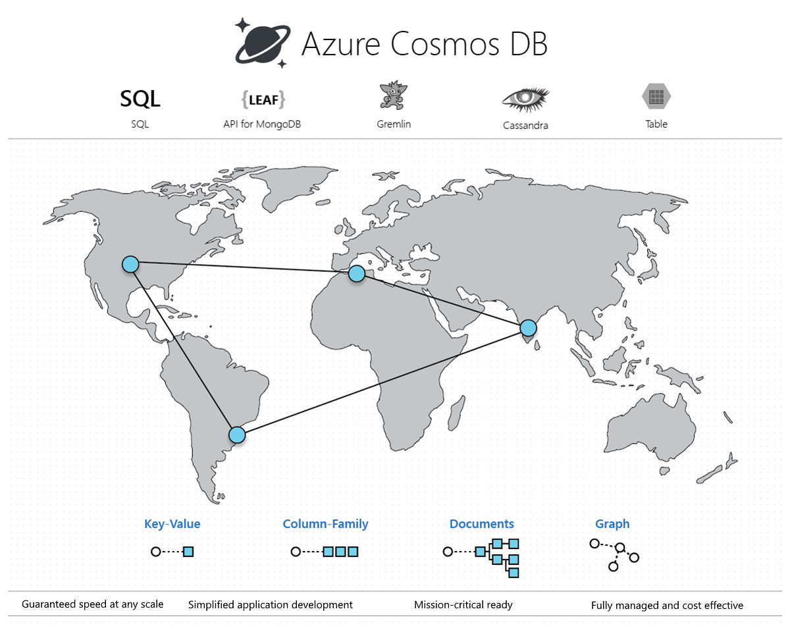
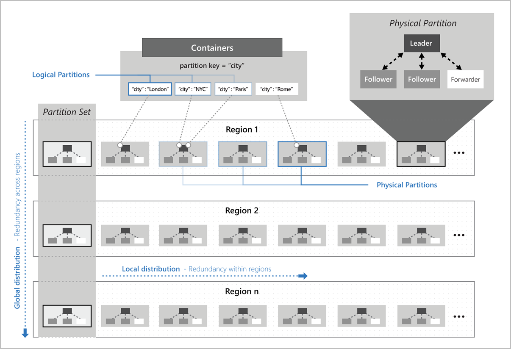
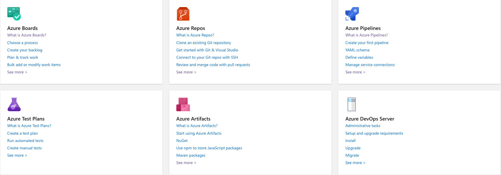

# Brief to Azure Data Development and Deployment


Agenda:

1. Azure overview
2. Azure Data Lake Gen2
3. Azure Cosmos DB
4. Azure Kubernetes Service (AKS)
5. Azure API Management (APIM)
6. Azure DevOps

## Azure overview

### Organize resources

Azure provide four levels of management: Management groups, Subscriptions, Resource groups, and Resources.


+ **Management groups** help you manage access, policy, and compliance for multiple subscriptions. All subscriptions in a management group automatically inherit the conditions applied to the management group.

+ **Subscriptions** logically associate user accounts with the resources they create. Each subscription has limits or quotas on the amount of resources it can create and use. Organizations can use subscriptions to manage costs and the resources created by users, teams, or projects.

+ **Resource groups** are logical containers where you can deploy and manage Azure resources like web apps, databases, and storage accounts.

+ **Resources** are instances of services that you can create, like virtual machines, storage, or SQL databases.

### Distinct Azure cloud environments

+ **Azure public cloud**, which is available globally.

+ **Azure China 21Vianet** is available through a unique partnership between Microsoft and 21Vianet, one of the country’s largest internet providers in China.

+ **Azure Germany** provides services under a data trustee model, which ensures that customer data remains in Germany under the control of T-Systems International GmbH, a subsidiary of Deutsche Telekom, acting as the German data trustee.

+ **Azure Government** is available in four regions in the United States to US government agencies and their partners.

+ **Azure Government for Department of Defense (DoD)** is available in two regions in the United States to the US Department of Defense.

## Azure Data Lake Gen2

Azure Data Lake Storage combines a file system with a storage platform to help you quickly identify insights into your data. Data Lake Storage Gen2 builds on Azure Blob storage capabilities to optimize it specifically for analytics workloads. This integration enables analytics performance, the tiering and data lifecycle management capabilities of Blob storage, and the high-availability, security, and durability capabilities of Azure Storage.

### Benefits

+ Variety and volume of data (exabyte scale)

+ High throughput (hundreds of gigabyte scale)

+ Hadoop compatible access (via Azure Databricks, Azure HDInsight and Azure Synapse Analytics)

+ Security (all data encrypted via either Microsoft or CMK, configurable through Hive/Spark or Azure Storage Explorer)

+ Data redundancy (Azure blob replication models, LRS/GRS)

### Features

+ Hadoop compatible access (Hadoop tools and frameworks, [ABFS driver](https://hadoop.apache.org/docs/stable/hadoop-azure/abfs.html))
    
    The ABFS driver is optimized specifically for big data analytics. The corresponding [REST APIs](https://docs.microsoft.com/en-us/rest/api/storageservices/data-lake-storage-gen2) are surfaced through the endpoint dfs.core.windows.net.

    ABFS URI
    ```
    abfs[s]://file_system@account_name.dfs.core.windows.net/<path>/<file_name>
    ```

    Go "Endpoints" to get ADLS Gen2 endpoints.

+ A superset of POSIX permissions (ACL and POSIX permission. Configure via Storage Exporer/Hive/Spark)

+ Hierarchical namespace
    + Atomic directory manipulation
    + Familiar interface style
    + [Azure RBAC](https://docs.microsoft.com/en-us/azure/storage/blobs/data-lake-storage-access-control-model#role-based-access-control)

+ Load data from Amazon Web services S3 to Azure Data Lake Storage with [Azure Data Factory (Azure ETL)](https://docs.microsoft.com/en-us/azure/data-factory/load-azure-data-lake-storage-gen2)

+ Get start with [Azure Synapse Analystics](https://docs.microsoft.com/en-us/azure/synapse-analytics/get-started)

## Azure Cosmos DB

Azure Cosmos DB is a fully managed NoSQL database for modern app development. Single-digit millisecond response times, and automatic and instant scalability, guarantee speed at any scale. Business continuity is assured with [SLA-backed](https://azure.microsoft.com/en-us/support/legal/sla/cosmos-db/v1_4/) availability and enterprise-grade security. App development is faster and more productive thanks to turnkey multi region data distribution anywhere in the world, open source APIs and SDKs for popular languages. As a fully managed service, Azure Cosmos DB takes database administration off your hands with automatic management, updates and patching. It also handles capacity management with cost-effective serverless and automatic scaling options that respond to application needs to match capacity with demand.



### Resouce model

An Azure Cosmos container is the fundamental unit of scalability. You can virtually have an unlimited provisioned throughput (RU/s) and storage on a container. Azure Cosmos DB transparently partitions your container using the logical partition key that you specify in order to elastically scale your provisioned throughput and storage.


### Features

+ Global distribution

    - [Consistency levels](https://docs.microsoft.com/en-us/azure/cosmos-db/consistency-levels): (Strong, Bounded staleness, Session, Consistent prefix, Eventual)
    

    - High availability (1. Data replication across regions confgiured within a Cosmos account. 2. Azure Comsmos DB mantains 4 replicas of data within a region.)

    - Conflict types and resolution policies when using multiple write regions (Insert/Replace/Delete conflicts, Last Write Wins/Custom)

    - [More details](https://docs.microsoft.com/en-us/azure/cosmos-db/global-dist-under-the-hood)

+ Partitioning and horizontal scaling

    - Logical partitions

        * A logical partition consists of a set of items that have the same partition key.

        * There is no limit to the number of logical partitions in your container. 20G per partition key.

    - Physical partitions

        * A container is scaled by distributing data and throughput across physical partitions. Internally, one or more logical partitions are mapped to a single physical partition. 

        * The number of physical partitions in a container depends on the following:
            
            * The number of throughput provisioned (each individual physical partition can provide a throughput of up to 10,000 request units per second). The 10,000 RU/s limit for physical partitions implies that logical partitions also have a 10,000 RU/s limit, as each logical partition is only mapped to one physical partition.

            * The total data storage (each individual physical partition can store up to 50GB data).

    

+ [Azure Synapse Link for Azure Cosmos DB](https://docs.microsoft.com/en-us/azure/cosmos-db/synapse-link)

## Azure Kubernetes Service (AKS)

[TBD](https://docs.microsoft.com/en-us/azure/aks/)

## Azure API Management (APIM)

[TBD](https://docs.microsoft.com/en-us/azure/api-management/)

## Azure DevOps

[TBD](https://docs.microsoft.com/en-us/azure/devops/?view=azure-devops)



+ [Azure Boards](https://docs.microsoft.com/en-us/azure/devops/boards/?view=azure-devops) (Scrum/Backlog, Plan/Track work)

+ [Azure Repos](https://docs.microsoft.com/en-us/azure/devops/repos/?view=azure-devops) (Code repos, Pull requests)

+ [Azure Pipelines](https://docs.microsoft.com/en-us/azure/devops/pipelines/?view=azure-devops) (Build/Deploy/Delivery, Run Tests)

+ [Azure Test Plans](https://docs.microsoft.com/en-us/azure/devops/test/?view=azure-devops) (Create test plan, Run automated/manual tests)

+ [Azure Artifacts](https://docs.microsoft.com/en-us/azure/devops/artifacts/?view=azure-devops) (Maven/npm/NuGet/PyPI/Symbols/Build artifacts, build in Azure pipelines)


## Reference
1. Microsoft Azure Portal https://ms.portal.azure.com/
2. Azure Blob Storage Documentation https://docs.microsoft.com/zh-cn/azure/storage/blobs/
3. Azure Cosmos DB Documentation https://docs.microsoft.com/en-us/azure/cosmos-db/
4. Microsoft Learn https://docs.microsoft.com/en-us/learn/